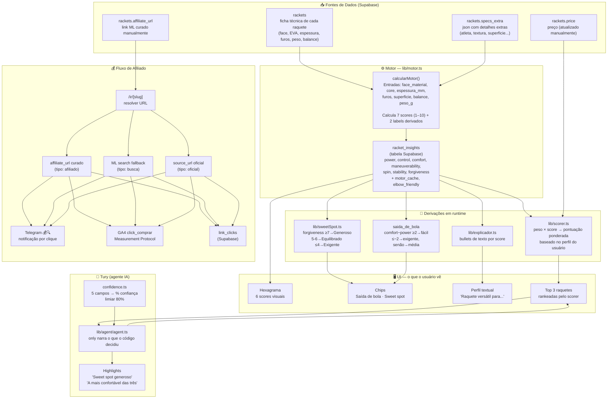
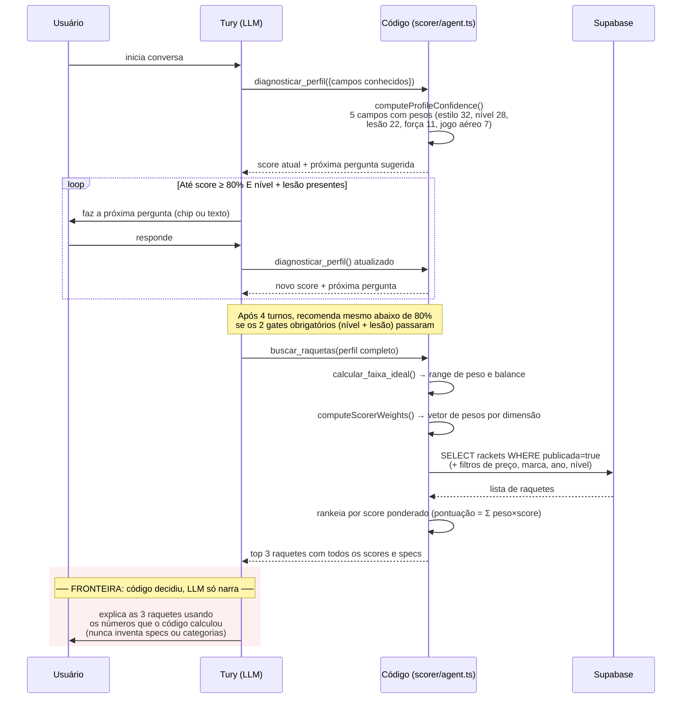
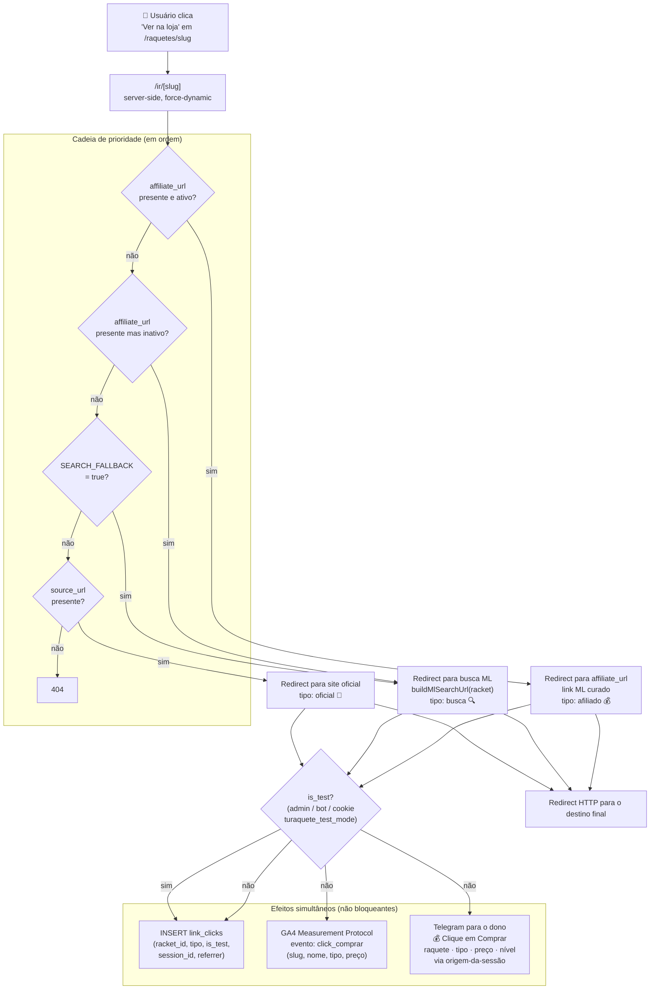

# Mapa do Sistema — Turaquete
_Referência para o dono do produto. PT-BR simples, baseado no código real._
<!-- AUTO-GEN:cabecera -->
_Versão: 0.3.856 · Hash: 9822533 · Gerado em: 2026-07-14_
<!-- /AUTO-GEN:cabecera -->

---

## 1. Diagrama Maestro — De onde vem cada dado e para onde vai

---

## 2. Tabela de Scores — Os 7 números que descrevem cada raquete

> O motor calcula esses números automaticamente a partir das especificações técnicas. Scores de 1 a 10. O **hexagrama** mostra 6 deles (tudo exceto forgiveness, que é derivado internamente).

<!-- AUTO-GEN:tabla-scores -->
| Score | Inputs | Lógica (lida de lib/motorTables.ts) | Rango | UI | Peso por perfil /100 |
|---|---|---|---|---|---|
| **Potência** (power) | face_material, core, balance | face: VIDRO→4…CARBON_24K→8; core SUPERSOFT/SOFT-1, HARD+1; balance cabeça+1 | 1–10 | Hexagrama | ini:8 · inter:5–26 · avan:14–32 · lesão:5 |
| **Controle** (control) | face_material, core, espessura_mm, furos, weight_g | base 4; SUPERSOFT+2, HARD-1; VIDRO/3K/Kevlar+1; esp≤20mm+2, ≥23mm−2; furos≥42−1; peso>340g−1 | 1–10 | Hexagrama | ini:16 · inter:12–25 · avan:15–27 · lesão:10 |
| **Conforto** (comfort) | core, tecnologias antivib, espessura_mm, weight_g | base 5; SUPERSOFT/SOFT+1, HARD-2; antivib+1/+2 (cap 2); VIDRO/Kevlar+1; 18K/24K/6K15K−1; esp≤20mm−1, ≥23mm+1; peso≥340g−1 | 1–10 | Hexagrama | ini:23 · inter:14–20 · avan:10–12 · lesão:40 |
| **Manuseio** (maneuverability) | espessura_mm, furos, weight_g | base 7; esp≤20mm+1, ≥23mm−1; peso≥340g−1; furos≥40+1, ≤20−1 | 1–10 | Hexagrama | ini:15 · inter:15–18 · avan:15–22 · lesão:15 |
| **Spin** | superficie (textura) | áspera→7; levemente→5 (sem spin tech) / 7 (com); lisa→3/5; sem dado→5 | 1–10 | Hexagrama | **0 em todos** (não entra no ranking) |
| **Estabilidade** (stability) | face_material, tecnologias estruturais, espessura_mm, weight_g | base 5; VIDRO/HYBRID_VIDRO/KEVLAR_PURE→-1; CARBON_24K→1; peso>340g+1; estrutural+1 (cap 1); esp≤20mm−1, ≥23mm+1; clamp [5,9] | 5–9 | Hexagrama | ini:16 · inter:17–20 · avan:18–23 · lesão:15 |
| **Forgiveness** | face_material, core, espessura_mm, formato | base 4; VIDRO+2, HYBRID_VIDRO+1, CARBON_24K-1; SUPERSOFT+2, HARD-1; redonda+1; esp≥22mm+1; 18K/24K cap 7 | 1–10 | Chip "Sweet spot" | ini:22 · inter:13–17 · avan:5–9 · lesão:15 |

**Labels derivados em runtime (não são scores, são categorias):**

| Label | Derivação | Valores |
|---|---|---|
| `sweet_spot` | forgiveness ≥7 → Generoso · 5–6 → Equilibrado · ≤4 → Exigente | Chip verde / cinza / âmbar |
| `saida_de_bola` | comfort−power ≥2 → fácil · ≤−2 → exigente · senão → média | Chip verde / cinza / âmbar |

**Regras absolutas do scorer:**
- Spin tem peso **0** em todos os perfis (não afeta ranking; serve só como referência visual)
- Lesão (cotovelo/ombro/punho) ativa override: conforto sobe para **40/100** independente do nível
- Forgiveness tem peso **22/100** para iniciantes — o mais alto de todos os perfis para esse score
<!-- /AUTO-GEN:tabla-scores -->

---

## 3. Diagrama de Uma Recomendação — O que é código e o que é IA

**O que o LLM nunca deve fazer:** inventar scores, citar "tolerância", usar "forgiveness", afirmar que uma raquete é para iniciante sem o campo `good_for_beginners` ser true.

---

## 4. Diagrama do Dinheiro — O caminho de um clique em "Ver na loja"

**Sessão stitching:** o parâmetro `?s=SESSION_ID` na URL de /ir/ permite rastrear de qual conversa com Tury veio o clique — ligando o clique ao contexto da recomendação.

**Detecção de loop:** se o `Referer` contém `/ir/`, o Telegram mostra emoji `🤖` de alerta ("Clique suspeito - loop").

---

## 5. Tabela de Jobs — Processos Recorrentes

| Job | O que faz | Quando roda | O que escreve | Como saber se falhou |
|---|---|---|---|---|
| **Resumo diário** (`/api/cron/daily-summary`) | Conta sessões, recomendações, cliques e custo de API do dia anterior (BRT). Envia mensagem HTML no Telegram. | Todo dia às **14:00 UTC** (11:00 BRT) via Vercel Cron | Nada (só leitura + Telegram) | Ausência da mensagem diária no Telegram |
| **Recalc motor** (`scripts/recalc-motor-v4.ts`) | Recalcula os 7 scores de todas as raquetes usando lib/motor.ts. Atualiza `racket_insights` no Supabase. | Manual — `npm run motor:recalc` | `racket_insights`: 7 scores + motor_cache + elbow_friendly | Erros no terminal; raquetes com scores desatualizados |
| **Quiz pré-calc** (`scripts/quiz-raquetes.ts`) | Pré-calcula o top-3 por arquétipo de quiz usando o scorer real. | Manual | `lib/quiz-raquetes.ts` (commitado no repo) | Arquivo de output desatualizado vs banco |

**⚠️ Não existe sync automático de preços.** Os preços são atualizados manualmente no admin.

---

## 6. Glosário Interno

| Termo | O que significa |
|---|---|
| **forgiveness** | Score interno (1–10) que mede o tamanho do sweet spot. Nunca mostrado ao usuário como número; vira o chip "Generoso / Equilibrado / Exigente". |
| **confiança** | Porcentagem (0–100%) calculada pela soma ponderada dos campos preenchidos do perfil do usuário. Limiar: 80%. |
| **gate obrigatório** | Campo que deve estar presente independente da pontuação de confiança: **nível** e **lesão**. Sem eles, Tury não recomenda. |
| **curado** | Link de afiliado Mercado Livre inserido manualmente para uma raquete específica. Prioridade máxima no /ir/. |
| **fallback** | Quando não há link curado: busca automática no ML pelo nome da raquete. Tipo: "busca". |
| **MP** | Measurement Protocol — API do Google Analytics 4 para enviar eventos server-side (sem JavaScript do browser). |
| **motor_cache** | JSON salvo em `racket_insights` com o resultado completo do último recalc. Contém saida_de_bola, sweet_spot e os 7 scores como o motor os calculou. |
| **specs_extra** | Campo JSON em `rackets` com dados que não cabem nas colunas principais (textura, furos, atleta, etc.). Alguns valores são stale — o motor_cache é a fonte confiável. |
| **publicada** | Único campo que controla visibilidade pública. `publicada = true` = aparece no site, no recomendador e no catálogo. |
| **is_test** | Flag que marca sessões de admin, bots ou teste manual (cookie). Excluído dos contadores e não dispara GA4 ou Telegram. |
| **overrides** | JSON em `racket_insights` que permite sobrescrever manualmente um score calculado pelo motor (ex: corrigir um valor que a fórmula errou). |
| **nivel_sugerido** | Texto em `racket_insights` gerado pelo admin ou IA: "Iniciante", "Intermediário", "Avançado". Diferente do campo `nivel` (raro) em specs_extra. |
| **derivarNivel** | Função de **EXIBIÇÃO** (`lib/nivel.ts`). Retorna o label público da raquete ("Pra quem: Iniciante/Intermediário/Avançado"). Usa `nivel_sugerido` do DB como fonte primária; fórmula como fallback. **Não usar para filtragem.** |
| **isAvancadaParaFiltro** | Função de **FILTRAGEM** (`lib/recommend.ts`). Gate que protege iniciantes/intermediários de raquetes avançadas. Usa scores diretamente (f≤4, f≤6+p≥8, etc.). Thresholds **propositalmente mais permissivos** que `derivarNivel` — mais raquetes chegam a iniciantes. **São conceitos distintos, não duplicatas; não fusionar.** |
| **session stitching** | Técnica de passar `?s=SESSION_ID` nos links de /ir/ para conectar o clique na loja ao contexto da conversa com Tury. |
| **hardcoded slug** | `beast-2023` está hardcoded em recommend.ts como fallback de entrada para cold start (quando há menos de 30 raquetes no pool). |
| **analise_aberta / ver_analise** | São o **mesmo clique** ("ver análise") medido em dois sistemas com propósitos distintos. `analise_aberta` dispara via `sendGAEvent` para GA4 (comportamento web). `ver_analise` insere em `feedback_events` via Supabase (funil do quiz, painel de qualidade). **Não são duplicatas; não unificar.** |

---

---

## Comandos do Mapa

| Comando | O que faz |
|---|---|
| `tsx scripts/gen-mapa.ts` | Regenera todas as seções AUTO-GEN e grava o arquivo |
| `tsx scripts/gen-mapa.ts --check` | Verifica se o mapa está desatualizado sem modificar nada (exit 1 se há divergência) |

As seções AUTO-GEN são delimitadas por marcadores `<!-- AUTO-GEN:nome -->` / `<!-- /AUTO-GEN:nome -->`.
Tudo fora dos marcadores é escrito a mão e não é tocado pelo script.

---

<!-- AUTO-GEN:umbrales -->
## 7. Umbrais e Constantes Chave

_Extraídos dinamicamente do código real. `arquivo:linha` é calculado ao gerar._

| Constante / Regra | Valor | Fonte |
|---|---|---|
| Confiança mínima para recomendar | `80%` | `lib/agent/confidence.ts:25` |
| Máximo de turnos sem recomendar | `4 turnos` | `lib/agent/confidence.ts:33` |
| Peso mínimo inviolável (CATALOGO_FLOOR) | `315g` | `lib/scorer.ts:33` |
| Janela mínima de faixa de peso | `15g (MIN_WINDOW)` | `lib/scorer.ts:125` |
| Forgiveness floor para pool de iniciante | `≤5 → excluída do pool` | `lib/recommend.ts:260` |
| isAvancadaParaFiltro (gate de filtragem) | `f≤4 | (f≤6 & (p≥8|c≥9)) | (f≤7 & p≥9)` | `lib/recommend.ts:247` |
| derivarNivel (exibição — distinto do gate) | `f≤4 | (f≤6 & (p≥7|c≥7)) | (f≤7 & p≥9)` | `lib/nivel.ts:23` |
| Sweet spot: Generoso | `forgiveness ≥7` | `lib/sweetSpot.ts:32` |
| Sweet spot: Equilibrado | `forgiveness 5–6` | `lib/sweetSpot.ts:32` |
| Saída de bola: fácil | `comfort−power ≥ 2` | `lib/saidaBola.ts:9` |
| Saída de bola: exigente | `comfort−power ≤ −2` | `lib/saidaBola.ts:9` |
| FACE_POWER range | `VIDRO→4 … CARBON_24K→8` | `lib/motorTables.ts:7` |
| CORE_POWER values | `SUPERSOFT/SOFT→-1, MEDIUM→0, HARD→+1` | `lib/motorTables.ts:15` |
| FACE_FORG range | `VIDRO→+2 … CARBON_24K→-1` | `lib/motorTables.ts:34` |
| CORE_COMFORT values | `SUPERSOFT/SOFT→+1, MEDIUM→0, HARD→-2` | `lib/motorTables.ts:41` |
| Stability: clamp | `[5, 9]` | `lib/motor.ts:114` |
| Faces 18K/24K: forgiveness cap | `7` | `lib/motor.ts:154` |
<!-- /AUTO-GEN:umbrales -->

<!-- AUTO-GEN:publicada -->
## 8. Raquete Publicada

**Critério único de visibilidade pública:** campo `publicada = true` na tabela `rackets`.

Controla: recomendador, catálogo, páginas, sitemap, todas as queries do código.
Campos que NÃO controlam visibilidade: `is_active` (se modelo está no mercado), `stock`, `destaque_atleta`.

**Contagem atual:** 249 raquetes publicadas

_Fonte: lib/recommend.ts:25–29 (comentário FIELD SEMANTICS)_
<!-- /AUTO-GEN:publicada -->
_Baseado no código real. Seções AUTO-GEN são geradas por `scripts/gen-mapa.ts`. Marcar com ⚠️ qualquer seção manual que divergir do comportamento observado em produção._
