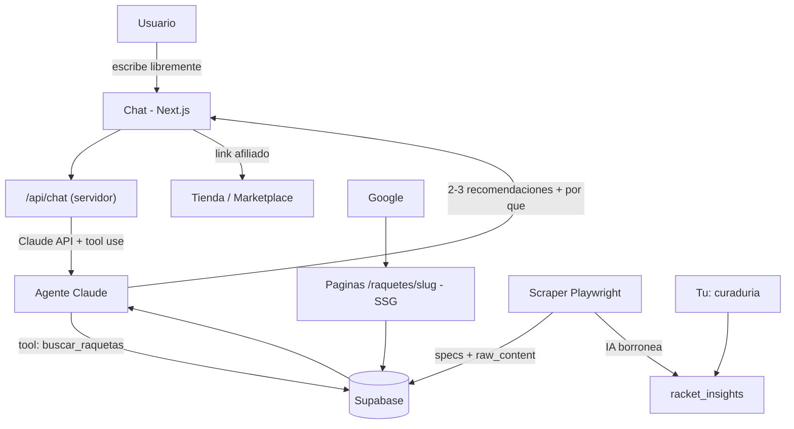

# Turaquete — Documento de diseño técnico

> Spec para implementar con Claude Code. Producto: agente IA conversacional que recomienda raquetas de beach tennis con razonamiento, fundamentado en una base de datos curada.

---

## 1. Visión y alcance

- **Producto:** una app web donde el usuario conversa libremente con una IA especialista en beach tennis. La IA extrae información del usuario, pregunta solo cuando falta algo crítico, y recomienda 2-3 raquetas explicando el porqué.
- **MVP:** solo marca **Heroe's** (~15-50 modelos, incluyendo años/colecciones). Es una marca premium italiana, enfocada en jugadores intermedios-avanzados, con precios ~R$3.200-4.330. Sirve para validar la idea con un catálogo pequeño y bien estructurado.
- **Visión:** cubrir **todas las marcas** de beach tennis. Por eso el diseño es brand-agnostic y escalable desde el día 1.
- **Monetización:** links de afiliado (Mercado Livre, Amazon, retailers como ProSpin/ProTenista, o programa propio de Heroe's si existe).
- **Regla de honestidad del agente:** durante la fase Heroe's-only, si el usuario pide algo fuera del catálogo (p.ej. presupuesto < precio mínimo disponible), la IA lo dice con transparencia, no inventa, y registra ese interés (sirve para priorizar qué marca sumar después).

---

## 2. Principios de diseño (no negociables)

1. **Grounding estricto.** La IA recomienda únicamente raquetas presentes en Supabase. Consulta la base vía *tool use / function calling*. Nunca inventa modelos, specs ni precios.
2. **Datos objetivos separados del conocimiento experto.** Los specs son hechos verificables (scrapeable). Los insights (potencia, control, confort…) son criterio curado: es el verdadero diferencial del proyecto.
3. **SEO de primera clase.** Además del chat, hay una página indexable por cada raqueta y por cada marca, generada desde la misma base. El chat convierte; las páginas traen tráfico orgánico (oxígeno de un sitio de afiliados).
4. **Esquema flexible.** Columnas tipadas para lo estable + `jsonb` para lo raro/por-marca + `raw_content`. Así se suman marcas/atributos sin rediseñar la base.
5. **Control de costos del LLM.** Modelo económico para extracción, modelo fuerte solo para la recomendación final; rate limiting por sesión/IP.
6. **Scraping del tamaño justo.** Para el MVP, un script de una sola pasada. El pipeline robusto multi-marca se construye al escalar, no antes.

---

## 3. Arquitectura del sistema



- **Frontend:** Next.js (App Router) + Tailwind. Dos superficies: el chat (home o `/recomendador`) y las páginas SEO estáticas (SSG) por raqueta y por marca.
- **Backend:** Route Handlers de Next.js. El agente corre **del lado servidor**; la `ANTHROPIC_API_KEY` nunca llega al navegador.
- **IA:** Claude API con tool use. El agente llama a una herramienta `buscar_raquetas(filtros)` que consulta Supabase y devuelve candidatos con sus insights.
- **Datos:** Supabase (Postgres + Storage para imágenes + Auth opcional a futuro).
- **Scraping:** proyecto Node + Playwright **aparte** (corre local o como job; no se despliega en Vercel). Inserta en Supabase.
- **Hosting:** Vercel (frontend + API routes).

---

## 4. Esquema SQL (Supabase / Postgres)

```sql
-- 1. Marcas
create table brands (
  id bigint generated always as identity primary key,
  name text not null unique,
  slug text not null unique,
  country text,
  website text,
  created_at timestamptz default now()
);

-- 2. Raquetas — DATOS OBJETIVOS (hechos verificables)
create table rackets (
  id bigint generated always as identity primary key,
  brand_id bigint references brands(id),
  name text not null,
  slug text not null unique,
  model_year int,
  weight_g int,
  balance text,             -- cabo / neutro / cabeca
  format text,              -- redondo / lagrima / diamante
  face_material text,       -- ej: Carbono 3K, Fibra de vidro
  core text,                -- ej: EVA Soft, EVA Black HR-15
  length_mm int,
  thickness_mm numeric,
  technologies text[],      -- ej: {Energy Node, CFD Edge}
  image_url text,
  price numeric,            -- precio actual (snapshot rapido)
  currency text default 'BRL',
  affiliate_url text,
  store text,
  specs_extra jsonb default '{}'::jsonb,   -- specs raros / por marca
  raw_content text,         -- texto original scrapeado, para reprocesar
  source_url text,
  is_active boolean default true,
  created_at timestamptz default now(),
  updated_at timestamptz default now()
);

-- 3. Conocimiento EXPERTO (interpretativo) — 1:1 con la raqueta
create table racket_insights (
  racket_id bigint primary key references rackets(id) on delete cascade,
  power smallint,           -- escalas 0-10
  control smallint,
  comfort smallint,
  maneuverability smallint,
  stability smallint,
  spin smallint,
  forgiveness smallint,     -- tolerancia a errores
  good_for_beginners boolean default false,
  good_for_intermediate boolean default false,
  good_for_advanced boolean default false,
  elbow_friendly boolean default false,
  shoulder_friendly boolean default false,
  observations jsonb default '[]'::jsonb,  -- ["Ideal para quien viene del tenis", ...]
  summary text,             -- resumen experto, 1-2 frases
  ai_drafted boolean default false,        -- lo borroneo la IA
  reviewed boolean default false,          -- tu lo validaste
  updated_at timestamptz default now()
);

-- 4. Conversaciones + perfil extraido por la IA
create table conversations (
  id bigint generated always as identity primary key,
  session_id text,
  messages jsonb default '[]'::jsonb,      -- historial de la charla
  profile jsonb default '{}'::jsonb,       -- {nivel, estilo, presupuesto, lesiones, preferencias}
  recommended_racket_ids bigint[],
  out_of_catalog boolean default false,    -- marca leads fuera de catalogo
  created_at timestamptz default now(),
  updated_at timestamptz default now()
);

-- 5. Historial de precios
create table price_history (
  id bigint generated always as identity primary key,
  racket_id bigint references rackets(id) on delete cascade,
  price numeric not null,
  currency text default 'BRL',
  store text,
  source_url text,
  captured_at timestamptz default now()
);
```

**Seguridad (RLS):** activar Row Level Security. Lectura pública para `brands`, `rackets`, `racket_insights`. Escrituras (scraper, curaduría, conversaciones) solo desde el servidor con la *service role key*, nunca desde el cliente.

> Nota: la tabla simple `raquetas` que se creó al inicio queda obsoleta. Se elimina con `drop table raquetas;` y se usa este esquema.

---

## 5. Estrategia de scraping (MVP: Heroe's)

**Fuentes:** sitio oficial (heroesbrandsport.com.br) para el catálogo y precios, complementado con retailers que traen specs detallados (ProSpin, ProTenista) para rellenar campos faltantes.

**Flujo del script (`scraper/`):**
1. Navegar la categoría de beach tennis y juntar las URLs de cada producto.
2. Por cada producto: extraer nombre, precio, specs (peso, material de cara, núcleo, formato, tecnologías), imagen, y guardar el HTML/texto completo en `raw_content`.
3. Normalizar: mapear a las columnas tipadas; lo que no calce, a `specs_extra` (jsonb).
4. Descargar imágenes a Supabase Storage (o guardar la URL).
5. Upsert idempotente en `rackets` (clave natural: `brand + name + model_year`, o `source_url`).

**Importante:**
- Una sola pasada para el MVP. Nada de auto-descubrimiento elaborado todavía.
- Respetar `robots.txt` y los términos de uso. Al escalar, preferir **feeds/API oficiales** (Mercado Livre, Amazon) antes que scraping crudo: más robusto y más limpio legalmente.
- Las imágenes de producto tienen copyright; usarlas para afiliados es común pero conviene tenerlo presente.

---

## 6. Pipeline: de dato scrapeado a conocimiento experto

1. **Capa objetiva (automática):** scraper → `rackets` + `raw_content`.
2. **Borrador experto (semi-asistido):** un script (`draft-insights.ts`) toma `raw_content` + specs y, vía Claude API, propone un borrador de `racket_insights` (ratings 0-10, flags, observaciones). Se guarda con `ai_drafted = true`, `reviewed = false`.
3. **Curaduría humana (tu moat):** tú revisas y ajustas los insights en Supabase. Marcas `reviewed = true`. La IA solo borronea; el criterio final es tuyo.

Como `raw_content` queda guardado, puedes **reprocesar** todo el catálogo cuando mejores el prompt de generación de insights, sin volver a scrapear.

---

## 7. El agente conversacional

**Loop por turno:**
1. El usuario escribe libremente.
2. El modelo actualiza el `profile` (nivel, estilo, presupuesto, lesiones, preferencias) en `conversations`.
3. Si falta info crítica para recomendar, pregunta **solo eso** (no un cuestionario).
4. Cuando hay suficiente, llama a la tool `buscar_raquetas(filtros)` contra Supabase.
5. Recibe candidatos con sus insights, razona, y recomienda 2-3 con explicación + link de afiliado.

**Tools (function calling):**
- `buscar_raquetas(nivel?, presupuesto_max?, prioridad?, codo_sensible?, ...)` → devuelve raquetas + insights.
- `detalle_raqueta(id)` → ficha completa (opcional).

El modelo **solo** usa lo que devuelven las tools. Nunca inventa.

**Manejo fuera de catálogo:** si nada calza (p.ej. presupuesto bajo el mínimo de Heroe's), responder con honestidad ("por ahora solo cubro Heroe's, que parte en ~R$3.2k; pronto sumo más marcas") y marcar `out_of_catalog = true` para análisis.

**Modelos sugeridos (verificar IDs y precios actuales en https://docs.claude.com):**
- Extracción de perfil / turnos baratos → un modelo rápido y económico (familia **Claude Haiku**).
- Recomendación final razonada → un modelo más fuerte (familia **Claude Sonnet**).

**Costos:** rate limiting por sesión/IP, límite de turnos por conversación, y la API key siempre del lado servidor.

---

## 8. SEO

- **SSG:** una página por raqueta en `/raquetes/[slug]` y una por marca en `/marcas/[slug]`, generadas desde Supabase, con specs + análisis experto + CTA de compra (link afiliado).
- `sitemap.xml`, metadatos (title/description), Open Graph, y datos estructurados schema.org `Product`.
- El chat vive en la home o `/recomendador`. Idea: ofrecer "chips" de inicio (sugerencias tappables) para reducir la fricción de la pantalla en blanco sin volver a un cuestionario.

> El contenido del sitio va en **portugués** (público brasileño), aunque este documento esté en español.

---

## 9. Estructura de carpetas

```
turaquete/
├── app/
│   ├── page.tsx                 # home con el chat / recomendador
│   ├── recomendador/page.tsx    # (opcional) el chat en ruta propia
│   ├── raquetes/[slug]/page.tsx # pagina SEO por raqueta (SSG)
│   ├── marcas/[slug]/page.tsx   # pagina por marca
│   ├── api/chat/route.ts        # endpoint del agente (server-side)
│   └── sitemap.ts
├── lib/
│   ├── supabase.ts              # cliente Supabase
│   ├── agent/
│   │   ├── tools.ts             # buscar_raquetas, detalle_raqueta
│   │   ├── prompt.ts            # system prompt del especialista
│   │   └── agent.ts             # loop de conversacion + tool use
│   └── recommend.ts             # consultas / filtros sobre la base
├── components/                  # chat, tarjetas de raqueta, CTA
├── scraper/                     # PROYECTO APARTE (no se despliega)
│   ├── scrape-heroes.ts         # Playwright: lista + extrae productos
│   ├── normalize.ts             # mapea a columnas + specs_extra
│   ├── draft-insights.ts        # IA borronea racket_insights
│   └── seed.ts                  # upsert en Supabase
├── supabase/migrations/         # el SQL del esquema, versionado
├── public/
├── .env.local                   # ANTHROPIC_API_KEY, SUPABASE_URL, SUPABASE_*_KEY
└── package.json
```

---

## 10. Escalamiento (30-50 Heroe's → multi-marca)

- El esquema ya es brand-agnostic: sumar marca = correr el scraper adaptado + curar insights.
- Al crecer: migrar de scraping a **feeds/API oficiales**; automatizar más el borrador de insights con revisión por muestreo; correr `price_history` por cron.
- **Búsqueda semántica (futuro):** activar `pgvector` en Supabase y generar embeddings de los insights/observaciones. Así el agente recupera por similitud ("algo para defender que perdone errores") además de por filtros duros. Buen norte cuando el catálogo se haga grande.

---

## 11. Decisiones abiertas (resolver antes o durante)

1. **Canal de afiliado para Heroe's:** ¿se vende en Mercado Livre/Amazon (afiliado directo), vía retailer, o Heroe's tiene programa propio? Esto define el `affiliate_url`.
2. **Cuántos modelos Heroe's reales hay** disponibles (puede ser < 50; incluir años/colecciones para llegar al número).
3. **robots.txt / términos de uso** de cada fuente a scrapear.
4. **Idioma del agente:** portugués para el usuario final.
